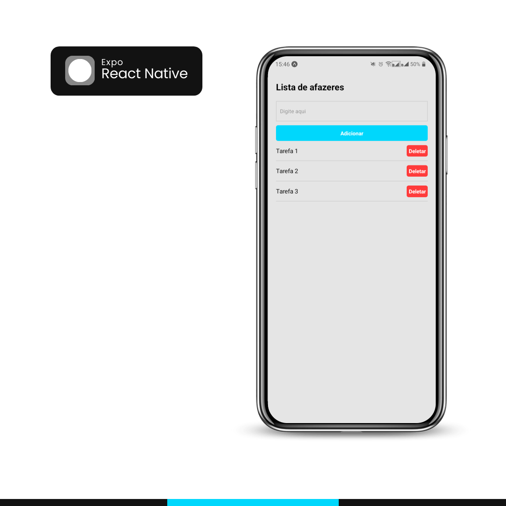

# Lista de Tarefas em React Native com TypeScript e Expo

Este é um projeto simples e mais para conhecer como é o mobile. Criei uma lista de tarefas desenvolvido em React Native utilizando o Expo e TypeScript.



## Funcionalidades

- Adicionar tarefas à lista;
- Remover tarefas da lista.

## Como executar o projeto

1. Clone este repositório em sua máquina local usando o git:

```bash
git clone https://github.com/seu-usuario/nome-do-repositorio.git
```

2. Instale as dependências do projeto:

```bash
npm i
```

3. Inicie o servidor Expo:

```bash
npm start
```

---

Este projeto está sob a licença [MIT](https://github.com/joaovic-tech/expo-app-test/blob/main/LICENSE). Sinta-se livre para utilizar, modificar e distribuir conforme os termos da licença.
